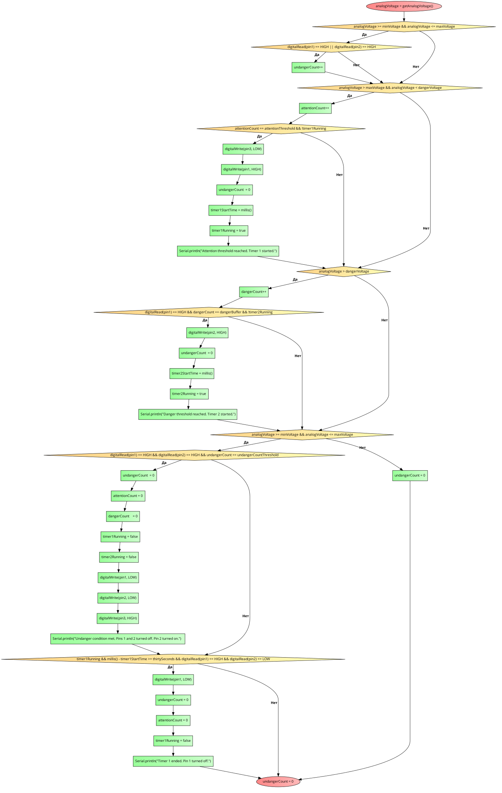

# Программа детектирования приближения грозы

# Тестирование

Отлаживалась программа на плате Arduino UNO. В качестве источника напряжения использовался обычный лабороторный блок питания. 

# Принцип работы

## Пины и их назначение
- Пин A0 - установлен как аналогвый инпут, сюда нужно подавать напряжение от 0 до 5В 
- Пин А1 - установлен как аналогвый инпут, сюда нужно подавать напряжение от 0 до 5В
**Важно** необходимо подать опорную землю на плату Arduino, чтобы analogRead() - работала нормально
- Пин 1 - установлен как диджитал оутпут, он включает реле ГДП
- Пин 2 - утсановлен как диджитал оутпут, он отключает возможность выключения фидеров
- Пин 3 - установлен как диджитал оутпут, он включает реле ГДО
**Важно** необходимо подключатьнагрузку через резисторы 

## Переменные и их назначение 
`minVoltage` - минимальное значение напряжение которое мы вообще будем детектировать
`maxVoltage` - напряжение блительности
`dangerVoltage` - опасное значение напряжения
`attentionThreshold` - макс кол-во сигналов бдительности
`dangerBuffer` - макс кол-во сигналов опасности
`undangerCountThreshold` - макс кол-во безопасных сигналов
`thirtySeconds` - сюда писать время работы таймеров для пина 1 и пина 2 в **милисекундах**

